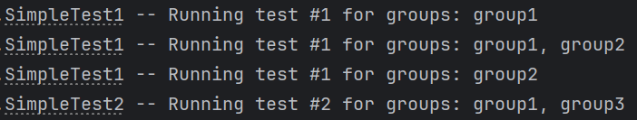
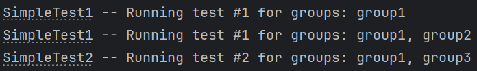
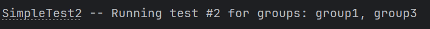

# TestNG groups selector

## Description

This mini project provides solution for TestNG method selection by groups when you want to select only those test methods which contains ALL of required groups to include.

### Initial problem

According to official TestNG [documentation](https://testng.org/#_test_groups) we can provide groups for tests via two options:
1. `-groups`: groups to include
2. `-excludegroups`: groups to exclude

But the problem is that TestNG will run all the tests which contains ANY of provided groups to include.

For example, if you have test method #1 with `groups=[group1]` and test method #2 with `groups=[group1,group2]` and use option for tests run `-groups="group1,group2"` than BOTH test #1 and test #2 will run.

But what if we want strictly choose test method only if it contains ALL of required groups to include? 

Provided in this code example is an answer for this question. Besides it is also an alternative to manual xml configuration.

### How to test

1. In [build.gradle.kts](build.gradle.kts) comment out line with provided TestNG listener:<br/>
```listeners.add("org.example.testng.config.GroupsAlterSuiteListener")```
2. Run `./gradlew clean test`. And you'll see that all tests run (and it's ok):<br/>

3. Run tests with groups `./gradlew clean test -Dgroups="group1,group3"`.<br/>
And you'll see that all tests which contains group1 OR group3 run:<br/>

4. In [build.gradle.kts](build.gradle.kts) uncomment line with provided TestNG listener:<br/>
```listeners.add("org.example.testng.config.GroupsAlterSuiteListener")```
5. Run tests with groups again `./gradlew clean test -Dgroups="group1,group3"`.<br/>
And you'll see that now only tests which contains group1 AND group3 run:<br/>



